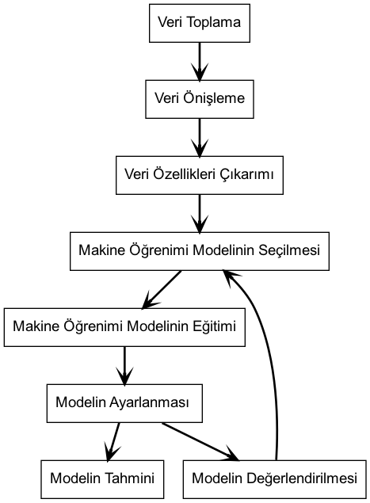
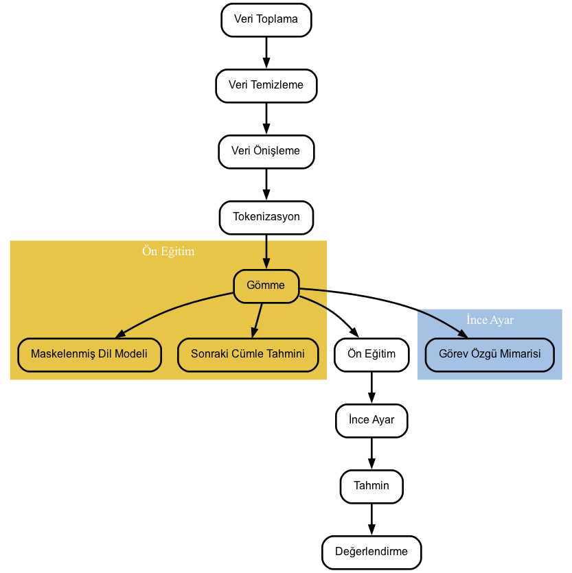

# Feza


## İçindekiler

- [Feza](#feza)
  - [İçindekiler](#i̇çindekiler)
  - [Biz kimiz? Amacımız nedir?](#biz-kimiz-amacımız-nedir)
  - [Takım Üyeleri](#takım-üyeleri)
  - [Method](#method)
    - [Verisetleri](#verisetleri)
    - [Süreç](#süreç)
    - [Genel iş akış diyagramı](#genel-iş-akış-diyagramı)
    - [Model mimarisi](#model-mimarisi)
    - [Sonuçlar](#sonuçlar)
  - [Çalıştırma](#çalıştırma)
    - [Config dosyası parametreleri](#config-dosyası-parametreleri)
    - [Train](#train)
    - [Prediction](#prediction)
    - [Evaluation](#evaluation)
  - [Referanslar](#referanslar)

## Biz kimiz? Amacımız nedir?

Feza, 2021 yılında Burak Akay tarafından kurulmuştur. Feza, açık kaynak topluluğunun gelişimine katkıda bulunan bir ekiptir. Nihai hedefimiz Türk NLP topluluğuna katkıda bulunmaktır.

## Takım Üyeleri
* Burak Akay burakpolsq@gmail.com
* Can Ahmet Özgüven canahmetozguven@gmail.com
* Abdurrahman İdris abdurahmanidris99@gmail.com 

## Method
Aşağıdaki yöntemler ile birlikte çalışıyoruz:
### Verisetleri
* [Ofansif veya ofansif olmayan kelimeleri sınıflandırma problemini çözmek için ek veri setimiz(Çöltekin, 2020).](https://hatespeechdata.com/#Turkish-header)
  
### Süreç
Zorbalık, insan ilişkilerinde sık görülen bir sorundur ve bu tür davranışların hem fail hem de mağdurlar için derin sonuçları olabilir. Zorbalık, tarih boyunca var olan ve araştırmacılar tarafından ilk kez 20. yüzyılın başında tanımlanan ve özellikle son yıllarda artan farkındalıkla ele alınması gereken bir olgu haline gelen bir olgudur. Gelişen teknoloji ve iletişim araçlarının çeşitliliği ile zorbalık farklı boyutlar kazanmaya başlamış ve sosyal medya, internet forumları gibi mecralarda bireylerin hayatını olumsuz etkilemeye başlamıştır. <br>
Çalışmamızın başında ilk olarak kısa bir literatür taraması yaparak zorbalık ve siber zorbalığın daha derinden anlaşılmasını sağladık. Literatürü tararken iki farklı model kullanıp veri setimizi arttırmamız gerektiğine karar verdik. İlk etapta verilen bir girdinin saldırgan olup olmadığına göre ikili bir sınıflandırma yaptık. Bu aşamada ayrıca veri setimizi genişleterek ve modelimizi ikili sınıflandırma probleminde daha genellenebilir hale getirerek modelimizin doğruluğunu artırdık.
İkinci aşamada ise ilk etapta veri setimizi artırmaya odaklanmış olmamıza rağmen doğal dil işleme alanında Türkçe veri setlerinin olmaması ve kullanılan etiketlerin kültür bağımlı olması nedeniyle bu şekilde ilerlemekten vazgeçtik. Bunun yerine Zhang, Yang Q., Yang Y. (2022) tarafından yapılan 'Dillerarası Dil Modeli İnce Ayarı Yoluyla Düşük Kaynaklı Metin Sınıflandırması' çalışmasından yararlanarak ConversionelBert modelini kullanarak bize sağlanan az sayıdaki veri seti ile yüksek sonuçlar elde edebildik. . <br>
Sonuç olarak, zorbalık ve siber zorbalık gibi öne çıkan konuların ele alınması hem bireysel hem de toplumsal düzeyde çok önemli bir adım olacaktır. Bu çalışma, doğal dil işleme tekniklerinin kullanımı ile zorbalığın tespit edilmesi ve sınıflandırılması için etkili bir yol sunmaktadır. Daha da önemlisi, bu çalışma zorbalıkla mücadeleye yönelik çalışmaların ve politikaların geliştirilmesinde faydalı olabilecek veriler sunmaktadır. Bu nedenle gelecekte de benzer çalışmaların yapılması, zorbalığın önlenmesi ve daha sağlıklı bir toplum yaratılması için önemlidir.<br>

### Genel iş akış diyagramı



### Model mimarisi


### Sonuçlar

**Distilled Turkish BERT**

| Metric   | Score     |
| -------- | --------- |
| F-Score  | 0.9852088 |
| Accuracy | 0.985335  |

[Model link](https://huggingface.co/dbmdz/distilbert-base-turkish-cased)

[Eğitilmiş model linki (Gdrive)](https://drive.google.com/drive/folders/1pyJ-laFbcjCmM8UDqVC0G1eUJ3XafeM5?usp=share_link)

**mC4 ELECTRA Bert**

| Metric   | Score     |
|----------|-----------|
| F-Score  | 0.9855    |
| Accuracy | 0.9857    |

[Model link](https://huggingface.co/dbmdz/electra-base-turkish-mc4-uncased-discriminator)

[Eğitilmiş model linki (Gdrive)](https://drive.google.com/drive/folders/1LE7fbrEysMV4JlZIz3IGuJS60UdSCHBQ?usp=share_link)

## Çalıştırma
Projenin kontrolü ve çalıştırılması kolay ve elastik bir şekilde gerçekleştirilebilir.

Projede 3 ana özellik vardır. Bunlar train, predict ve eval'dır.
  * `train`: BERT model eğitimini sağlar.
  * `predict`: eğitilmiş modelin verilen veriseti üzerinde sınıflandırma tahmini yapmasını sağlar.
  * `eval`: verilen etiketli veri üzerinde yapılan tahminlerin sonucu f1-score (makro) ve accuracy fonksiyonlarıyla hesaplanır ve skor bilgisi sağlanır.

Tüm bu özellikler main scripti aracılığı ile kontrol edilebilir. main scripti 2 argüman alır:
  * `--config_yaml_path` (yaml formatındaki config dosyasının yolu default: configs/config.yaml)
  * `--mode` (3 ana özellikten hangisinin çalıştırılması istendiği [train, predict, eval])
  
### Config dosyası parametreleri

  * `device:` Proje kodlarının hangi sürücüde çalıştırılacağı belirlenir. [cpu || cuda:0]
  * `seed_val`: Verisetinde her çalıştırmada aynı rastgele sıralamanın oluşmasına olanak tanır. Bunu, verilen integer'a göre yapar.
  * `epochs`: Eğitim sırasında verisetinin kaç defa modele verileceğini belirtir.
  * `batch_size`: Tek epoch'da aynı anda kaç verinin modele verileceğini belirtir.
  * `train_split_ratio`: Verisetinde train ve test ayrıştırılması yapılırken yüzde kaç train verisi olacağı bu orana göre hesaplanır.[0.9=>%90]
  * `data_path`: Veriseti yolu
  * `text_column`: Verilen csv verisetinde hangi kolonun text içerdiğini belirtir.
  * `target_column`: Verilen csv verisetinde hangi kolonun sınıfları içerdiğini belirtir.
  * `output_path`: Model ve tonizer çıktılarının hangi dosyaya kaydedilmesi istendiği belirtilir.
  * `model_folder`: Eğitilecek modelin dosya yolu belirtilir. Huggingface modelleri de verilebilir. [dbmdz/convbert-base-turkish-mc4-cased]
  * `tokenizer_folder`: Tokenizer dosya yolunu belirtir.  Huggingface tokenizerleri de verilebilir. [dbmdz/convbert-base-turkish-mc4-cased]
  * `training_json_file`: Json formatında verilen dosya ismine train history kaydeder.
  * `cache_dir`: Model için gerekli olabilecek cache dosyası yolunu belirtir. Huggingface modelleri kullanılıyorsa modeller bu klasöre indirilir ve buradan kullanılır.
  * `classes`: Sınıfları belirtir.

  ```console
  git clone https://github.com/fezateam/feza_text_classification.git
  ```
  ```console
  cd feza_text_classification
  ```  
 ### Train
  ```console
  python3 main.py --config_yaml_path configs/config.yaml --mode train
  ```
  
 ### Prediction
  ```console
  python3 main.py --config_yaml_path configs/config.yaml --mode predict
  ```
  
 ### Evaluation
  ```console
  python3 main.py --config_yaml_path configs/config.yaml --mode eval
  ```
  
## Referanslar
   Çöltekin, C., 2020. A Corpus of Turkish Offensive Language on Social Media. In: Proceedings of the 12th International Conference on Language Resources and Evaluation. <br>
   Zhang, X., Yang, Q., & Yang, Y. (2021). Low-resource text classification via cross-lingual language model fine-tuning. Knowledge-Based Systems, 230, 107374. DOI: https://doi.org/10.1016/j.knosys.2021.107374 <br>
